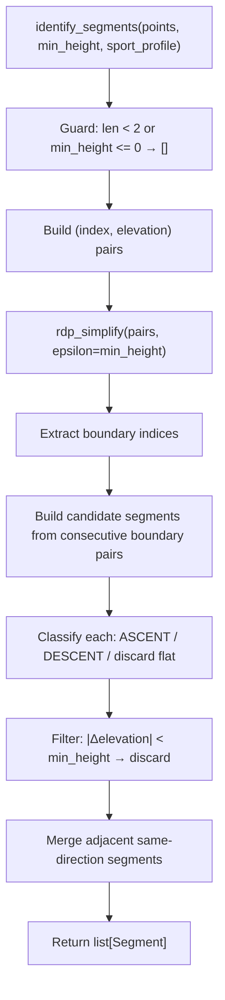

# Design Document: Douglas-Peucker Segments

## Overview

This design replaces the internals of `identify_segments()` in `gpx_segment_report/segments.py` with a Ramer-Douglas-Peucker (RDP) based pipeline. The public function signature remains unchanged: `identify_segments(points, min_height, sport_profile) -> list[Segment]`.

The new algorithm operates in four stages:

1. **Simplify** — Run the RDP algorithm on `(index, elevation)` pairs using `min_height` as epsilon. This produces a subset of indices (boundary points) that capture the significant shape of the elevation profile.
2. **Segment** — Walk consecutive boundary point pairs. Each pair defines a candidate segment. Classify as ASCENT or DESCENT based on elevation change direction; discard flat (zero-change) pairs.
3. **Filter** — Discard candidate segments whose absolute elevation change is less than epsilon (`min_height`).
4. **Merge** — Merge adjacent segments that share the same direction (which can arise after filtering removes a trivial segment between two same-direction segments).

This pipeline is simpler to reason about than the current state machine, naturally handles trailing segments (the last boundary pair always produces a candidate), and absorbs brief pauses because flat spots have low perpendicular distance from the simplified line.

## Architecture



All logic lives in `gpx_segment_report/segments.py`. No new modules or dependencies are introduced.

### Internal Helper Functions

| Function | Responsibility |
|---|---|
| `_rdp_simplify(points, epsilon)` | Recursive RDP on `list[tuple[float, float]]` → `list[int]` (sorted indices of retained points) |
| `_perpendicular_distance(point, line_start, line_end)` | Perpendicular distance from a 2D point to a line segment |
| `_build_segments(track_points, boundary_indices, min_height)` | Classify, filter, and merge boundary pairs into `list[Segment]` |

## Components and Interfaces

### Public Interface (unchanged)

```python
def identify_segments(
    points: list[TrackPoint],
    min_height: float,
    sport_profile: SportProfile,
) -> list[Segment]:
```

- `points`: Ordered track points with elevations in meters.
- `min_height`: Minimum elevation change in meters. Doubles as the RDP epsilon tolerance.
- `sport_profile`: Preserved for future use; not consulted by the algorithm.
- Returns: `list[Segment]` in chronological order.

### Internal: `_rdp_simplify`

```python
def _rdp_simplify(
    points: list[tuple[float, float]],
    epsilon: float,
) -> list[int]:
```

Standard recursive RDP. Operates on `(x, y)` = `(index, elevation)` pairs. Returns a sorted list of indices into the input list that form the simplified polyline.

**Algorithm sketch:**
1. If the segment has ≤ 2 points, return both endpoint indices.
2. Find the point with the maximum perpendicular distance from the line connecting the first and last points.
3. If that distance ≥ epsilon, recurse on both halves and merge results.
4. Otherwise, return only the two endpoint indices.

### Internal: `_perpendicular_distance`

```python
def _perpendicular_distance(
    point: tuple[float, float],
    line_start: tuple[float, float],
    line_end: tuple[float, float],
) -> float:
```

Computes the perpendicular distance from `point` to the line defined by `line_start` and `line_end` using the standard cross-product formula:

```
d = |((y2-y1)*x0 - (x2-x1)*y0 + x2*y1 - y2*x1)| / sqrt((y2-y1)² + (x2-x1)²)
```

When `line_start == line_end` (degenerate line), returns the Euclidean distance from `point` to `line_start`.

### Internal: `_build_segments`

```python
def _build_segments(
    track_points: list[TrackPoint],
    boundary_indices: list[int],
    min_height: float,
) -> list[Segment]:
```

1. Walk consecutive pairs of boundary indices.
2. For each pair `(i, j)`: compute `Δelev = track_points[j].elevation - track_points[i].elevation`.
3. If `Δelev == 0`: skip (flat).
4. If `|Δelev| < min_height`: skip (trivial).
5. Otherwise: create a candidate `(start_idx, end_idx, SegmentType)`.
6. Merge adjacent candidates with the same `SegmentType` by extending the previous candidate's `end_idx`.
7. Build final `Segment` objects with `points = tuple(track_points[start_idx : end_idx + 1])`.

## Data Models

No new data models are introduced. The existing models are reused as-is:

### Existing Models (from `gpx_segment_report/models.py`)

```python
@dataclass(frozen=True)
class TrackPoint:
    timestamp: datetime
    elevation: float  # meters

@dataclass(frozen=True)
class Segment:
    segment_type: SegmentType  # ASCENT or DESCENT
    points: tuple[TrackPoint, ...]

    # Derived properties: start_time, end_time, start_elevation, end_elevation
```

### Internal Representation

During processing, the RDP algorithm operates on `list[tuple[float, float]]` where each tuple is `(index, elevation)`. The index is the position in the original `points` list (cast to float for the distance calculation). After simplification, boundary indices are plain `int` values used to slice back into the original `TrackPoint` list.

No intermediate data classes are needed — the pipeline uses tuples and index lists throughout.


## Correctness Properties

*A property is a characteristic or behavior that should hold true across all valid executions of a system — essentially, a formal statement about what the system should do. Properties serve as the bridge between human-readable specifications and machine-verifiable correctness guarantees.*

### Property 1: Classification matches elevation direction

*For any* list of track points and any valid min_height, every returned segment classified as ASCENT must have `end_elevation > start_elevation`, and every segment classified as DESCENT must have `end_elevation < start_elevation`.

**Validates: Requirements 2.1, 2.2, 2.3**

### Property 2: Minimum height threshold enforced

*For any* list of track points and any valid min_height, every returned segment must have `|end_elevation - start_elevation| >= min_height`.

**Validates: Requirements 3.1**

### Property 3: No consecutive same-direction segments

*For any* list of track points and any valid min_height, no two consecutive returned segments shall have the same `segment_type`. Adjacent same-direction segments must have been merged.

**Validates: Requirements 3.2**

### Property 4: Segment structural invariants

*For any* list of track points and any valid min_height:
- (a) Returned segments are in chronological order (each segment's start index ≥ the previous segment's end index).
- (b) Each segment's `points` tuple is a contiguous slice of the input list (no gaps, preserving original order).
- (c) For any two consecutive segments, the last point of segment N is the same object as the first point of segment N+1 (boundary sharing).

**Validates: Requirements 6.1, 6.2, 6.3, 6.4**

### Property 5: Flat tracks produce zero segments

*For any* list of track points where all elevations are identical, and any valid min_height, the function shall return an empty list.

**Validates: Requirements 5.3**

### Property 6: Monotonic tracks produce exactly one segment

*For any* strictly monotonically increasing (or decreasing) list of elevations whose total elevation change is ≥ min_height, the function shall return exactly one segment covering the entire track.

**Validates: Requirements 5.4**

### Property 7: RDP simplification is idempotent

*For any* list of `(index, elevation)` pairs and any epsilon > 0, applying `_rdp_simplify` twice produces the same set of retained indices as applying it once. That is, `rdp(rdp(points, ε), ε) == rdp(points, ε)`.

**Validates: Requirements 1.1** (validates the RDP implementation itself)

## Error Handling

| Condition | Behavior |
|---|---|
| `len(points) < 2` | Return `[]` immediately |
| `min_height <= 0` | Return `[]` immediately |
| All elevations identical | RDP retains only first and last points; the single candidate segment has zero elevation change and is discarded → `[]` |
| Single point with `NaN` or `Inf` elevation | Not guarded — the caller (`parse_gpx`) is responsible for providing valid floats. The existing property tests already use `allow_nan=False, allow_infinity=False`. |
| Very large input (thousands of points) | The recursive RDP may hit Python's default recursion limit (~1000). For typical GPX tracks (hundreds to low thousands of points), this is not an issue. If needed in the future, an iterative RDP variant can be substituted. |

No exceptions are raised by `identify_segments()`. It always returns a (possibly empty) `list[Segment]`.

## Testing Strategy

### Dual Testing Approach

Both unit tests and property-based tests are required:

- **Property-based tests** (Hypothesis): Verify universal correctness properties across randomly generated inputs. Each property from the Correctness Properties section above maps to one property-based test.
- **Unit tests** (pytest): Verify specific examples, edge cases, and integration with the existing pipeline.

### Property-Based Testing Configuration

- **Library**: [Hypothesis](https://hypothesis.readthedocs.io/) (already a dev dependency)
- **Minimum iterations**: 200 per property test (consistent with existing tests)
- **Tag format**: Each test is annotated with a comment: `# Feature: douglas-peucker-segments, Property {N}: {title}`
- **Each correctness property is implemented by a single property-based test**

### Property Test Plan

| Test | Property | Generator Strategy |
|---|---|---|
| `test_classification_matches_elevation_direction` | Property 1 | Random elevation lists (floats, size 2–200), random min_height |
| `test_every_segment_meets_min_height` | Property 2 | Random elevation lists, random min_height |
| `test_no_consecutive_same_direction` | Property 3 | Random elevation lists, random min_height |
| `test_segment_structural_invariants` | Property 4 | Random elevation lists, random min_height |
| `test_flat_tracks_produce_zero_segments` | Property 5 | Constant elevation repeated N times, random min_height |
| `test_monotonic_tracks_produce_one_segment` | Property 6 | Strictly monotonic elevation sequences with total change ≥ min_height |
| `test_rdp_simplify_idempotent` | Property 7 | Random `(index, elevation)` pair lists, random epsilon |

### Unit Test Plan

| Test | What it verifies |
|---|---|
| `test_empty_input` | 0 points → `[]` |
| `test_single_point` | 1 point → `[]` |
| `test_zero_min_height` | min_height=0 → `[]` |
| `test_negative_min_height` | min_height=-5 → `[]` |
| `test_simple_v_shape` | Known V-shaped elevation → 1 descent + 1 ascent |
| `test_simple_peak` | Known peak elevation → 1 ascent + 1 descent |
| `test_trivial_segment_filtered` | Small bump below min_height is discarded |
| `test_merge_after_filter` | Two ascents separated by a trivial descent merge into one ascent |
| `test_perpendicular_distance_degenerate` | line_start == line_end case |

### Backward Compatibility

The existing property tests in `tests/test_segments.py` test structural invariants (min_height threshold, classification correctness, structural ordering, flat tracks) that are algorithm-agnostic. They must continue to pass with the new RDP-based implementation. The new tests will be added alongside them in the same file or a new `tests/test_rdp_segments.py` file.
