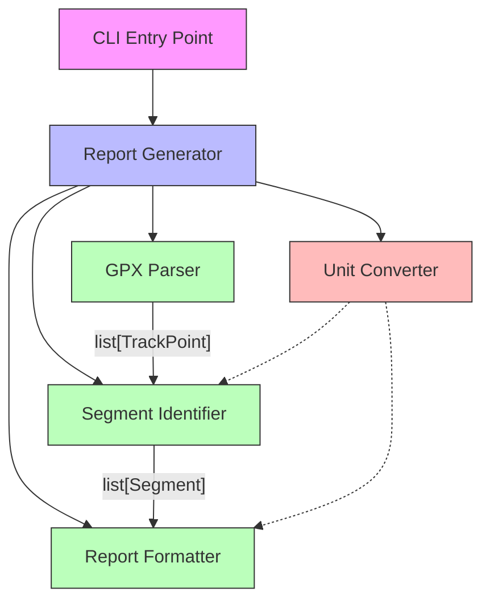
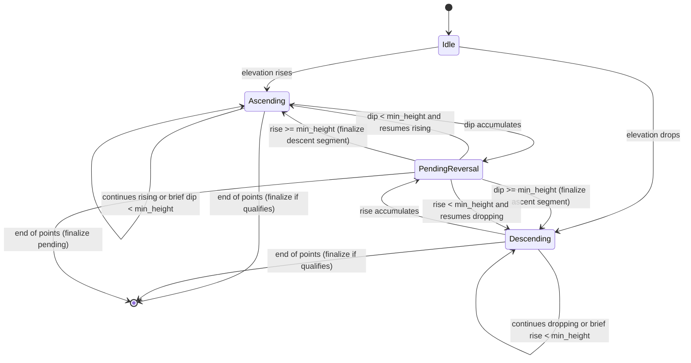

# Design Document: GPX Segment Report

## Overview

The GPX Segment Report application is a command-line Python tool that parses GPX 1.1 track files and produces a tabular report of climbing and descending segments. The core challenge is identifying coarse-grained elevation segments from noisy GPS data — absorbing brief reversals that fall below a configurable minimum height threshold.

The application follows a pipeline architecture: parse GPX → extract track points → identify segments → format report. It uses `gpxpy` for GPX parsing, supports configurable elevation units (feet/meters), minimum height thresholds, and sport-specific segmentation profiles (initially ski touring).

### Key Design Decisions

1. **gpxpy for parsing**: The `gpxpy` library handles GPX 1.1 parsing including Garmin extensions. It returns structured Python objects with elevation, timestamps, and coordinates already extracted.
2. **Pipeline over OOP hierarchy**: The processing flow is a straightforward data pipeline. Each stage transforms data and passes it forward. This keeps the code simple and testable.
3. **Segment identification via state machine**: A single-pass state machine walks the track points, tracking the current trend direction and accumulating elevation changes. Brief reversals below the minimum height threshold are absorbed into the surrounding segment.
4. **Pure functions for testability**: The segment identification and unit conversion logic are pure functions operating on data classes, making them easy to property-test without file I/O.

## Architecture



### Component Responsibilities

- **CLI Entry Point**: Parses command-line arguments (file path, PRL unit, minimum height, sport profile) and invokes the Report Generator.
- **Report Generator**: Orchestrates the pipeline — calls the parser, passes track points through segment identification, and formats the output.
- **GPX Parser**: Uses `gpxpy` to read a GPX file and extract an ordered list of `TrackPoint` values. Validates that elevation and timestamp data are present.
- **Segment Identifier**: Implements the state-machine algorithm that walks track points and identifies coarse-grained ascending/descending segments, absorbing brief reversals.
- **Unit Converter**: Converts elevations between meters and feet. When PRL is meters, values pass through unchanged.
- **Report Formatter**: Produces the tabular output with the required columns.

## Components and Interfaces

### Module: `gpx_segment_report/parser.py`

```python
def parse_gpx(file_path: str) -> list[TrackPoint]:
    """Parse a GPX 1.1 file and return ordered track points.

    Raises:
        GpxParseError: If the file is missing, invalid, lacks elevation
                       data, lacks timestamps, or contains no track segments.
    """
```

Uses `gpxpy.parse()` internally. Iterates over `gpx.tracks → track.segments → segment.points`, extracting elevation and time from each point. Validates completeness before returning.

### Module: `gpx_segment_report/segments.py`

```python
def identify_segments(
    points: list[TrackPoint],
    min_height: float,
    sport_profile: SportProfile,
) -> list[Segment]:
    """Identify coarse-grained ascending/descending segments.

    Walks the track points using a state machine. Brief reversals
    (elevation changes below min_height) are absorbed into the
    surrounding segment. Returns segments in chronological order.
    """
```


### Module: `gpx_segment_report/converter.py`

```python
METERS_TO_FEET: float = 3.28084

def convert_elevation(value_meters: float, unit: ElevationUnit) -> float:
    """Convert an elevation from meters to the target unit.

    When unit is METERS, returns value unchanged.
    When unit is FEET, multiplies by METERS_TO_FEET.
    """

def default_min_height(unit: ElevationUnit) -> float:
    """Return the default minimum height for the given unit.

    Returns 100.0 for feet, 30.0 for meters.
    """
```

### Module: `gpx_segment_report/formatter.py`

```python
def format_report(
    segments: list[Segment],
    unit: ElevationUnit,
) -> str:
    """Format segments into a tabular report string.

    Columns: start_time (ISO 8601), end_time (ISO 8601), type (ascent/descent),
    total_time (HH:MM:SS), start_elevation (PRL), end_elevation (PRL),
    rate (PRL/hour).

    Returns header row even when segments list is empty.
    """
```

### Module: `gpx_segment_report/models.py`

Contains all data classes and enums used across the application.

### Module: `gpx_segment_report/cli.py`

```python
def main() -> None:
    """CLI entry point. Parses arguments and runs the report pipeline."""
```

Uses `argparse` with the following arguments:
- `file` (positional): Path to the GPX file.
- `--unit` / `-u`: Elevation unit, choices `feet` | `meters`, default `feet`.
- `--min-height` / `-m`: Minimum height threshold in PRL units (optional, uses default based on unit).
- `--sport` / `-s`: Sport profile name, default `ski_touring`.

### Segment Identification Algorithm

The segment identifier uses a single-pass state machine with the following states:



The algorithm tracks:
- `current_direction`: ascending, descending, or idle
- `segment_start_index`: index of the first track point in the current segment
- `segment_peak` / `segment_trough`: the highest and lowest elevations seen in the current segment
- `reversal_accumulator`: the accumulated elevation change in the opposite direction

When the reversal accumulator exceeds `min_height`, the current segment is finalized (from `segment_start_index` to the point where the reversal began) and a new segment starts. When the track ends, any in-progress segment is finalized if its total elevation change meets the `min_height` threshold.

## Data Models

```python
from dataclasses import dataclass
from datetime import datetime
from enum import Enum


class ElevationUnit(Enum):
    FEET = "feet"
    METERS = "meters"


class SegmentType(Enum):
    ASCENT = "ascent"
    DESCENT = "descent"


@dataclass(frozen=True)
class TrackPoint:
    """A single point from a GPX track."""
    timestamp: datetime
    elevation: float  # always stored in meters (native GPX unit)


@dataclass(frozen=True)
class Segment:
    """A coarse-grained ascending or descending segment."""
    segment_type: SegmentType
    points: tuple[TrackPoint, ...]  # ordered track points in this segment

    @property
    def start_time(self) -> datetime:
        return self.points[0].timestamp

    @property
    def end_time(self) -> datetime:
        return self.points[-1].timestamp

    @property
    def start_elevation(self) -> float:
        return self.points[0].elevation

    @property
    def end_elevation(self) -> float:
        return self.points[-1].elevation


@dataclass(frozen=True)
class SportProfile:
    """Sport-specific segmentation configuration."""
    name: str
    # Future: sport-specific thresholds can be added here.
    # For now, the min_height parameter drives segmentation.


# Pre-defined sport profiles
SKI_TOURING = SportProfile(name="ski_touring")

SUPPORTED_SPORTS: dict[str, SportProfile] = {
    "ski_touring": SKI_TOURING,
}


class GpxParseError(Exception):
    """Raised when GPX parsing fails due to missing or invalid data."""
    pass
```

### Key Data Flow

1. `parse_gpx()` → `list[TrackPoint]` (elevations in meters, timestamps as `datetime`)
2. `identify_segments(points, min_height_in_meters, sport_profile)` → `list[Segment]`
   - The `min_height` is converted to meters before being passed in, so the algorithm always works in meters internally.
3. `format_report(segments, unit)` → `str`
   - The formatter converts elevations from meters to PRL units at display time using `convert_elevation()`.

This means the segment identifier is unit-agnostic — it always operates on meter values. Unit conversion happens at two boundaries: when the user specifies `min_height` in PRL units (converted to meters for the algorithm), and when the formatter displays elevations (converted from meters to PRL units).


## Correctness Properties

*A property is a characteristic or behavior that should hold true across all valid executions of a system — essentially, a formal statement about what the system should do. Properties serve as the bridge between human-readable specifications and machine-verifiable correctness guarantees.*

### Property 1: Parser round-trip preserves track points

*For any* sequence of (timestamp, elevation) pairs used to construct a valid GPX 1.1 XML string, parsing that string with `parse_gpx` should return `TrackPoint` values with the same timestamps in the same order and the same elevation values (within floating-point tolerance).

**Validates: Requirements 1.1, 1.2**

### Property 2: Parser rejects GPX data missing elevation

*For any* GPX XML string where one or more track points lack an `<ele>` element, `parse_gpx` should raise a `GpxParseError`.

**Validates: Requirements 1.3**

### Property 3: Unit conversion correctness

*For any* elevation value `v` in meters: `convert_elevation(v, FEET)` equals `v * 3.28084` (within floating-point tolerance), and `convert_elevation(v, METERS)` equals `v` exactly.

**Validates: Requirements 2.3, 2.4**

### Property 4: Minimum height threshold enforced on segments

*For any* list of track points and any positive `min_height`, every segment returned by `identify_segments` should have an absolute elevation change (|end_elevation − start_elevation|) greater than or equal to `min_height`.

**Validates: Requirements 3.4, 5.2**

### Property 5: Segment classification matches elevation trend

*For any* segment returned by `identify_segments`, if the segment type is `ASCENT` then `end_elevation > start_elevation`, and if the segment type is `DESCENT` then `end_elevation < start_elevation`.

**Validates: Requirements 5.1**

### Property 6: Segment structural invariants

*For any* list of track points and output of `identify_segments`: (a) the points within each segment appear in the same relative order as in the input, (b) no track point appears in more than one segment, and (c) for any two consecutive segments, the first segment's last point appears before the second segment's first point in the original input.

**Validates: Requirements 5.3, 5.4, 5.6**

### Property 7: Flat tracks produce zero segments

*For any* list of track points where the difference between the maximum and minimum elevation is less than `min_height`, `identify_segments` should return an empty list.

**Validates: Requirements 5.5**

### Property 8: Unsupported sport profile rejected

*For any* string that is not a key in `SUPPORTED_SPORTS`, the report generator should raise an error listing the supported sport types.

**Validates: Requirements 4.4**

### Property 9: Report row count and chronological order

*For any* list of segments, `format_report` should produce exactly `len(segments)` data rows (excluding the header), and the rows should appear in the same chronological order as the input segments sorted by start time.

**Validates: Requirements 6.1, 6.5**

### Property 10: Report rows contain all required fields

*For any* segment, the corresponding report row should contain: a valid ISO 8601 start timestamp, a valid ISO 8601 end timestamp, a segment type string ("ascent" or "descent"), a total time in HH:MM:SS format, a start elevation, an end elevation, and an elevation rate.

**Validates: Requirements 6.2**

### Property 11: Report computation correctness

*For any* segment with known start time, end time, start elevation, and end elevation: the total time field should equal `end_time - start_time` formatted as HH:MM:SS, and the elevation rate should equal `abs(end_elevation - start_elevation) / total_hours` (within floating-point tolerance).

**Validates: Requirements 6.3, 6.4**

## Error Handling

### Error Categories

| Error Condition | Component | Exception | Message Pattern |
|---|---|---|---|
| File not found | GPX Parser | `GpxParseError` | "File not found: {path}" |
| Invalid GPX XML | GPX Parser | `GpxParseError` | "Invalid GPX file: {path}" |
| Missing elevation | GPX Parser | `GpxParseError` | "Track point at index {i} is missing elevation data" |
| Missing timestamps | GPX Parser | `GpxParseError` | "Track point at index {i} is missing timestamp data" |
| No track segments | GPX Parser | `GpxParseError` | "GPX file contains no track segments" |
| Unsupported sport | Report Generator | `ValueError` | "Unsupported sport profile '{name}'. Supported: {list}" |

### Error Strategy

- All errors that prevent report generation are raised as exceptions with informative messages.
- The CLI entry point catches these exceptions, prints the message to stderr, and exits with a non-zero status code.
- No partial output is produced on error — the application either succeeds with a complete report or fails with a clear message.

## Testing Strategy

### Test Framework and Libraries

- **pytest** for test execution (per project standards)
- **hypothesis** for property-based testing (Python's standard PBT library)
- Minimum **100 examples** per property test (Hypothesis default is 100, which meets this requirement)

### Property-Based Tests

Each correctness property from the design maps to a single Hypothesis test. Tests use `@given` decorators with custom strategies to generate:

- Random sequences of `TrackPoint` values with valid timestamps and elevations
- Random GPX XML strings (for parser round-trip tests)
- Random elevation values (for unit conversion tests)
- Random `min_height` thresholds

Each property test is tagged with a comment referencing the design property:
```python
# Feature: gpx-segment-report, Property 1: Parser round-trip preserves track points
```

### Unit Tests

Unit tests complement property tests by covering:

- **Default values**: PRL defaults to feet (Req 2.2), min_height defaults to 100ft/30m (Req 3.2, 3.3), sport defaults to ski_touring (Req 4.2)
- **Edge cases**: Empty report with headers only (Req 6.6), GPX with no track segments (Req 7.1), missing timestamps (Req 7.2), non-existent file path (Req 1.4)
- **Integration**: End-to-end test using `sample-data/Ordering_is_Important.gpx` to verify the full pipeline produces a valid report

### Test Organization

```
tests/
├── test_parser.py          # Parser round-trip property + error edge cases
├── test_converter.py       # Unit conversion property
├── test_segments.py        # Segment identification properties (P4-P7)
├── test_formatter.py       # Report formatting properties (P9-P11)
└── test_cli.py             # CLI integration + default value examples
```
