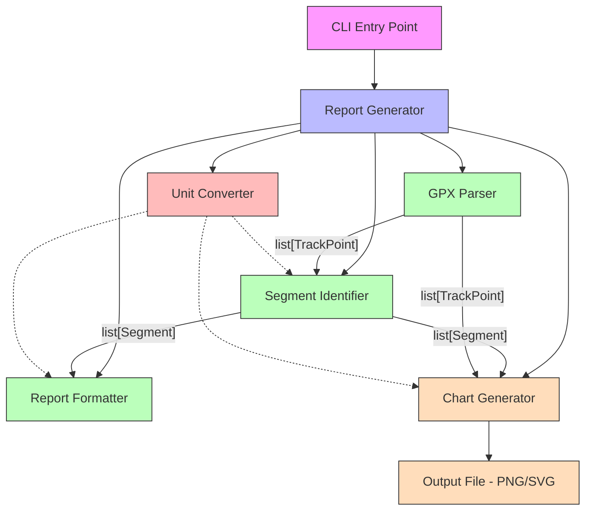
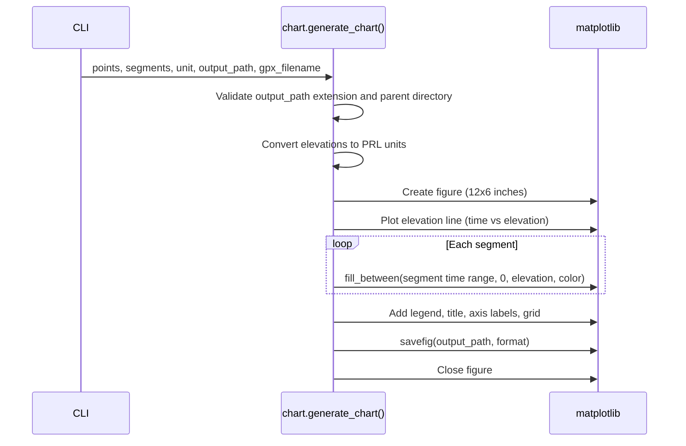

# Design Document: Graphical Output

## Overview

The Graphical Output feature adds elevation profile chart generation to the GPX Segment Report CLI. It produces a matplotlib-rendered chart that plots elevation (in PRL units) against time for all track points, with colored fill overlays highlighting identified ascent and descent segments. The chart is saved to a user-specified file path in PNG or SVG format.

The feature integrates into the existing pipeline as an optional post-processing step. When the user supplies an `--output` flag, the chart is generated and saved alongside the normal text report on stdout. When omitted, behavior is unchanged.

### Key Design Decisions

1. **matplotlib for rendering**: matplotlib is the standard Python plotting library. It supports PNG and SVG output natively, handles time-axis formatting, and provides `fill_between` for segment overlays. No custom rendering code is needed.
2. **New `chart.py` module**: Chart generation is isolated in a single new module (`gpx_segment_report/chart.py`). This keeps the existing modules untouched and makes the charting logic independently testable.
3. **Format detection by file extension**: The output format (PNG/SVG) is determined by the file extension of the output path. This avoids an extra CLI flag and matches user expectations.
4. **Pure data in, file out**: The chart generation function accepts track points, segments, unit, and output path — all data that already exists in the pipeline. It does not re-parse or re-identify segments.

## Architecture



The Chart Generator sits alongside the Report Formatter as a parallel output stage. Both consume the same `list[TrackPoint]` and `list[Segment]` data. The CLI conditionally invokes the Chart Generator only when `--output` is provided.

## Components and Interfaces

### Module: `gpx_segment_report/chart.py` (new)

```python
from pathlib import Path

from gpx_segment_report.models import ElevationUnit, Segment, TrackPoint


SUPPORTED_FORMATS: set[str] = {".png", ".svg"}


def generate_chart(
    points: list[TrackPoint],
    segments: list[Segment],
    unit: ElevationUnit,
    output_path: str,
    gpx_filename: str,
) -> None:
    """Render an elevation profile chart and save it to disk.

    Plots elevation (converted to PRL units) on the y-axis against
    track point timestamps on the x-axis. Identified segments are
    highlighted with colored fill beneath the elevation line.

    Args:
        points: Ordered track points (elevations in meters).
        segments: Identified ascending/descending segments.
        unit: Elevation unit for y-axis labeling and values.
        output_path: Destination file path (.png or .svg).
        gpx_filename: Original GPX file name for the chart title.

    Raises:
        ValueError: If the file extension is unsupported or the
                    parent directory does not exist.
    """
```

This is the only new module. It encapsulates all matplotlib interaction.

### Module: `gpx_segment_report/cli.py` (modified)

The CLI gains one new optional argument:

```python
parser.add_argument(
    "--output",
    "-o",
    default=None,
    help="Save an elevation profile chart to this file path (.png or .svg)",
)
```

When `args.output` is provided, the CLI calls `generate_chart()` after producing the text report. The text report is always printed to stdout regardless.

### Internal Chart Rendering Flow



## Data Models

No new data models are introduced. The chart generator consumes existing types:

- `TrackPoint` — provides `timestamp` (x-axis) and `elevation` (y-axis, in meters)
- `Segment` — provides `segment_type`, `points` (for overlay time ranges and elevations)
- `ElevationUnit` — determines y-axis label and conversion factor
- `SegmentType` — determines overlay color (ascent vs descent)

### Chart Configuration Constants

These are defined as module-level constants in `chart.py`:

| Constant | Value | Purpose |
|---|---|---|
| `FIGURE_WIDTH` | `12` | Chart width in inches |
| `FIGURE_HEIGHT` | `6` | Chart height in inches |
| `ASCENT_COLOR` | `"#2ecc71"` (green) | Fill color for ascent overlays |
| `DESCENT_COLOR` | `"#e74c3c"` (red) | Fill color for descent overlays |
| `ASCENT_ALPHA` | `0.3` | Fill transparency for ascent |
| `DESCENT_ALPHA` | `0.3` | Fill transparency for descent |
| `LINE_COLOR` | `"#2c3e50"` (dark blue) | Elevation profile line color |
| `SUPPORTED_FORMATS` | `{".png", ".svg"}` | Allowed output file extensions |

### Data Flow

1. `parse_gpx(file_path)` → `list[TrackPoint]` (elevations in meters)
2. `identify_segments(points, min_height_meters, sport_profile)` → `list[Segment]`
3. `format_report(segments, unit)` → `str` (printed to stdout)
4. `generate_chart(points, segments, unit, output_path, gpx_filename)` → writes file to disk
   - Internally converts elevations from meters to PRL units via `convert_elevation()`
   - Extracts timestamps for x-axis, converted elevations for y-axis
   - For each segment, uses `fill_between()` over the segment's time range
   - Saves figure using matplotlib's `savefig()` with format inferred from extension


## Correctness Properties

*A property is a characteristic or behavior that should hold true across all valid executions of a system — essentially, a formal statement about what the system should do. Properties serve as the bridge between human-readable specifications and machine-verifiable correctness guarantees.*

### Property 1: Plotted data correctness

*For any* list of track points and any elevation unit, the elevation profile line plotted by `generate_chart` should contain exactly as many data points as there are track points, and each y-value should equal `convert_elevation(point.elevation, unit)` (within floating-point tolerance) for the corresponding track point.

**Validates: Requirements 1.1, 1.4, 1.5**

### Property 2: Segment overlay correspondence

*For any* list of segments, the chart should contain one filled region per segment, and each filled region's x-axis range should span from the segment's start time to the segment's end time.

**Validates: Requirements 2.1, 2.3**

### Property 3: Segment overlay color consistency

*For any* mix of ascent and descent segments, all ascent overlays should use the same fill color, all descent overlays should use a different fill color, and the two colors should be distinct from each other.

**Validates: Requirements 2.2**

### Property 4: Output file format correctness

*For any* valid track data and output path with a supported extension, `generate_chart` should create a file at that path whose content matches the expected format — PNG files should begin with the PNG magic bytes (`\x89PNG`), and SVG files should contain valid SVG/XML markup.

**Validates: Requirements 3.1, 3.2, 3.3**

### Property 5: Unsupported extension rejection

*For any* output file path whose extension is not `.png` or `.svg`, `generate_chart` should raise a `ValueError` with a message listing the supported formats.

**Validates: Requirements 3.4**

### Property 6: Missing directory rejection

*For any* output file path whose parent directory does not exist, `generate_chart` should raise a `ValueError` with a message indicating the directory was not found.

**Validates: Requirements 3.5**

### Property 7: Chart title contains filename

*For any* GPX filename string passed to `generate_chart`, the rendered chart's title should contain that filename string.

**Validates: Requirements 5.1**

### Property 8: Figure size invariant

*For any* invocation of `generate_chart`, the rendered figure should have dimensions of 12 inches wide by 6 inches tall.

**Validates: Requirements 5.2**

## Error Handling

### Error Categories

| Error Condition | Component | Exception | Message Pattern |
|---|---|---|---|
| Unsupported file extension | Chart Generator | `ValueError` | "Unsupported output format '{ext}'. Supported: .png, .svg" |
| Parent directory missing | Chart Generator | `ValueError` | "Output directory not found: {dir}" |

### Error Strategy

- The chart generator validates the output path (extension and parent directory existence) before doing any matplotlib work. This fails fast and avoids wasted rendering time.
- Errors are raised as `ValueError`, consistent with the existing pattern in `cli.py` where `ValueError` and `GpxParseError` are caught and printed to stderr.
- The CLI's existing `except (GpxParseError, ValueError)` handler already covers these new error cases — no changes to error handling logic in `cli.py` are needed beyond adding the `--output` argument and calling `generate_chart`.

## Testing Strategy

### Test Framework and Libraries

- **pytest** for test execution
- **hypothesis** for property-based testing (already a dev dependency)
- **matplotlib** used in tests to inspect figure/axes objects (no image comparison needed)
- Minimum **100 examples** per property test

### Property-Based Tests

Each correctness property maps to a single Hypothesis test in `tests/test_chart.py`. Tests generate random track point lists and segment configurations, call `generate_chart` (or an internal helper that returns the figure without saving), and inspect the matplotlib figure object programmatically.

Strategy for testing without file I/O on every property test: extract chart construction into a helper that returns the `matplotlib.figure.Figure` object. The public `generate_chart` function calls this helper and then saves. Property tests for chart content (Properties 1–3, 7–8) test the helper directly. Properties 4–6 test the full `generate_chart` function using `tmp_path`.

Each property test is tagged with a comment:
```python
# Feature: graphical-output, Property 1: Plotted data correctness
```

### Unit Tests

Unit tests complement property tests for specific examples and integration:

- **Axis labels**: y-axis label contains "feet" or "meters" matching the unit (Req 1.2, 1.3)
- **Legend**: chart includes a legend with "Ascent" and "Descent" entries (Req 2.5)
- **Zero segments**: chart renders without overlays when segments list is empty (Req 2.4)
- **Grid**: chart axes have grid enabled (Req 5.4)
- **CLI integration**: `--output` flag is accepted, chart file is created when provided, text report still goes to stdout (Req 4.1–4.4)
- **CLI without --output**: no chart file is created, text report is produced (Req 4.4)

### Test Organization

```
tests/
├── test_chart.py           # Property tests (P1-P8) + unit tests for chart module
├── test_cli.py             # Extended with CLI integration tests for --output flag
└── ...                     # Existing test files unchanged
```

### Testing Approach for matplotlib

Rather than comparing rendered images (which is brittle), tests inspect the matplotlib object model:

- `fig.get_size_inches()` → verify figure dimensions
- `ax.get_lines()[0].get_ydata()` → verify plotted elevation values
- `ax.collections` → count and inspect `PolyCollection` objects from `fill_between`
- `ax.get_title()` → verify title text
- `ax.get_ylabel()` → verify y-axis label
- `ax.get_legend()` → verify legend presence and labels
- `ax.xaxis.get_gridlines()` → verify grid is enabled
