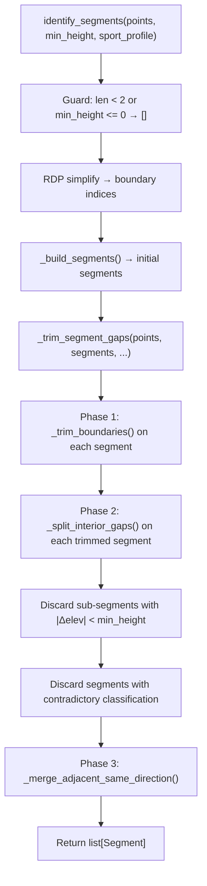

# Design Document: Segment Gap Trimming

## Overview

This design adds a post-processing step to the existing RDP-based segment detection pipeline in `gpx_segment_report/segments.py`. After `_build_segments()` produces the initial segment list, a new `_trim_segment_gaps()` function detects and removes flat/stagnant stretches from segment boundaries and interiors.

The trimming operates in three phases:

1. **Boundary trimming** — For each segment, scan inward from the start and end to detect leading/trailing flat stretches. If a flat stretch meets the minimum trim duration, slice it off the segment.
2. **Interior splitting** — For each boundary-trimmed segment, slide a time window across the interior to find prolonged flat regions. Split the segment at each detected flat stretch, producing sub-segments with gaps between them.
3. **Post-trim merge** — After all trimming and splitting, merge any adjacent same-direction segments that may have become neighbors due to discarded intermediate segments.

All new logic is implemented as private helper functions in `gpx_segment_report/segments.py`. The public `identify_segments()` signature is unchanged — the trimming step is called internally after `_build_segments()`.

## Architecture



All logic lives in `gpx_segment_report/segments.py`. No new modules or dependencies are introduced.

### Internal Helper Functions (new)

| Function | Responsibility |
|---|---|
| `_is_window_flat(points, start_idx, end_idx, flatness_threshold)` | Check whether the elevation range within a slice of points is at or below the flatness threshold |
| `_find_leading_flat(points, time_window, flatness_threshold)` | Scan from the start of a point sequence forward, extending as long as consecutive time windows remain flat. Returns the index of the first non-flat point (or `len(points)` if entirely flat) |
| `_find_trailing_flat(points, time_window, flatness_threshold)` | Scan from the end of a point sequence backward, extending as long as consecutive time windows remain flat. Returns the index of the last non-flat point + 1 (or 0 if entirely flat) |
| `_trim_boundaries(segment, time_window, flatness_threshold, min_trim_duration)` | Apply leading and trailing flat detection to a single segment. Returns a trimmed `Segment` or `None` if the segment is consumed |
| `_find_interior_flat_stretches(points, time_window, flatness_threshold, min_trim_duration)` | Slide a time window across the interior of a point sequence to find all flat stretches that meet the minimum trim duration. Returns a list of `(start_idx, end_idx)` tuples marking flat regions |
| `_split_interior_gaps(segment, time_window, flatness_threshold, min_trim_duration, min_height)` | Split a segment at each interior flat stretch, discarding sub-segments below min_height or with contradictory classification |
| `_merge_adjacent_same_direction(segments)` | Merge consecutive segments sharing the same `SegmentType`, combining their point ranges |
| `_trim_segment_gaps(all_points, segments, flatness_threshold, time_window, min_trim_duration, min_height)` | Top-level orchestrator: boundary trim → interior split → filter → merge |

### Integration Point

Inside `identify_segments()`, after the existing `_build_segments()` call:

```python
segments = _build_segments(points, boundary_indices, min_height)
segments = _trim_segment_gaps(
    all_points=points,
    segments=segments,
    flatness_threshold=3.0,
    time_window=60.0,
    min_trim_duration=120.0,
    min_height=min_height,
)
return segments
```

## Components and Interfaces

### Public Interface (unchanged)

```python
def identify_segments(
    points: list[TrackPoint],
    min_height: float,
    sport_profile: SportProfile,
) -> list[Segment]:
```

The signature, parameter semantics, and return type are identical to the current implementation. Gap trimming is an internal post-processing step with hardcoded default parameters (flatness_threshold=3.0, time_window=60.0, min_trim_duration=120.0).

### Flat Detection Core

The flat detection algorithm uses TrackPoint timestamps (not index distance) to measure window duration:

```python
def _is_window_flat(
    points: tuple[TrackPoint, ...] | list[TrackPoint],
    start_idx: int,
    end_idx: int,
    flatness_threshold: float,
) -> bool:
```

Computes `max(elevation) - min(elevation)` over `points[start_idx:end_idx+1]`. Returns `True` if the range is ≤ `flatness_threshold`.

### Boundary Scanning

Leading flat detection starts at index 0 and advances a window endpoint forward. The window always starts at index 0 and grows until either:
- The time span from `points[0]` to `points[end]` reaches `time_window` seconds, at which point we check flatness. If flat, we advance the start of the next check window and continue.
- A window is found to be non-flat, at which point we stop.

The leading flat stretch is the maximal prefix where all consecutive time windows are flat. The trim point is the first TrackPoint after this flat stretch.

Trailing flat detection mirrors this logic, scanning backward from the last point.

```python
def _find_leading_flat(
    points: tuple[TrackPoint, ...],
    time_window: float,
    flatness_threshold: float,
) -> int:
    """Return the index of the first point after the leading flat stretch.

    Returns 0 if no leading flat stretch is detected.
    """
```

```python
def _find_trailing_flat(
    points: tuple[TrackPoint, ...],
    time_window: float,
    flatness_threshold: float,
) -> int:
    """Return the index one past the last point before the trailing flat stretch.

    Returns len(points) if no trailing flat stretch is detected.
    """
```

### Interior Sliding Window

For interior gap detection, a sliding time window advances through the segment's points. At each position, the window covers all points within `time_window` seconds of the current point. If the window is flat, we extend the flat stretch forward. When the window becomes non-flat (or we reach the end), we record the flat stretch if its duration meets `min_trim_duration`.

```python
def _find_interior_flat_stretches(
    points: tuple[TrackPoint, ...],
    time_window: float,
    flatness_threshold: float,
    min_trim_duration: float,
) -> list[tuple[int, int]]:
    """Find all interior flat stretches meeting the minimum trim duration.

    Returns a list of (start_idx, end_idx) tuples (inclusive) marking
    flat regions. Only stretches fully interior to the segment (not
    touching the first or last point) are returned, since boundary
    trimming handles edges.
    """
```

### Segment Splitting

```python
def _split_interior_gaps(
    segment: Segment,
    time_window: float,
    flatness_threshold: float,
    min_trim_duration: float,
    min_height: float,
) -> list[Segment]:
    """Split a segment at interior flat stretches.

    Each resulting sub-segment inherits the original segment's classification.
    Sub-segments with |Δelev| < min_height are discarded.
    Sub-segments whose classification contradicts their elevation direction
    are discarded.
    """
```

### Post-Trim Merge

```python
def _merge_adjacent_same_direction(
    segments: list[Segment],
    all_points: list[TrackPoint],
) -> list[Segment]:
    """Merge adjacent segments sharing the same SegmentType.

    When merging, the combined segment spans from the first segment's
    first point to the second segment's last point, including all
    original TrackPoints between those positions (looked up from
    all_points).
    """
```

This requires access to the full `all_points` list so that merged segments include all intermediate TrackPoints (not just the union of the two segments' point tuples, which may have a gap between them).

## Data Models

No new data models are introduced. The existing models are reused as-is:

### Existing Models (from `gpx_segment_report/models.py`)

```python
@dataclass(frozen=True)
class TrackPoint:
    timestamp: datetime
    elevation: float  # meters

@dataclass(frozen=True)
class Segment:
    segment_type: SegmentType  # ASCENT or DESCENT
    points: tuple[TrackPoint, ...]

    # Derived properties: start_time, end_time, start_elevation, end_elevation
```

### Internal Representation

During trimming, segments are manipulated by slicing their `points` tuples. Flat stretch boundaries are tracked as index pairs `(start_idx, end_idx)` into a segment's `points` tuple. No intermediate data classes are needed.

The `_merge_adjacent_same_direction()` function uses the full `all_points` list to look up TrackPoints by identity (using `id()`) to find the index range for merged segments, consistent with how `_build_segments()` constructs segments from the original point list.


## Correctness Properties

*A property is a characteristic or behavior that should hold true across all valid executions of a system — essentially, a formal statement about what the system should do. Properties serve as the bridge between human-readable specifications and machine-verifiable correctness guarantees.*

### Property 1: Flat window detection matches elevation range

*For any* sequence of TrackPoints and any flatness threshold, `_is_window_flat()` returns `True` if and only if `max(elevation) - min(elevation) <= flatness_threshold` over the given index range.

**Validates: Requirements 3.1, 3.2**

### Property 2: Boundary trimming removes flat edges and preserves active content

*For any* segment whose leading or trailing points form a flat stretch (elevation range ≤ flatness_threshold over consecutive time windows) with duration ≥ min_trim_duration, the trimmed segment SHALL NOT include those flat boundary points. If trimming consumes the segment to fewer than 2 points, the segment is discarded entirely. Otherwise, the trimmed segment's start (or end) elevation differs from the original by at least the flat stretch's extent.

**Validates: Requirements 1.3, 1.4, 1.6**

### Property 3: Interior flat stretches cause segment splitting

*For any* segment containing an interior flat stretch (elevation range ≤ flatness_threshold over a sliding time window) whose duration ≥ min_trim_duration, the gap trimmer SHALL produce multiple sub-segments from that single input segment, with no sub-segment spanning across the flat stretch.

**Validates: Requirements 2.2, 2.5**

### Property 4: Segments without flat stretches pass through unchanged

*For any* list of segments where no time window within any segment has an elevation range ≤ flatness_threshold, the gap trimmer SHALL return segments identical to the input (same points, same classification, same order).

**Validates: Requirements 5.3**

### Property 5: Trimmed segment points are contiguous subsequences of the input

*For any* output segment after gap trimming, its `points` tuple must be a contiguous subsequence of the original full track point list (preserving order, with no gaps within the segment). When two segments are merged, the merged segment includes all TrackPoints from the original input between the first and last point of the merged segment.

**Validates: Requirements 6.2, 6.3, 7.3**

### Property 6: No consecutive same-direction segments in output

*For any* input to the gap trimmer, the output shall contain no two adjacent segments with the same `SegmentType`. Adjacent same-direction segments must have been merged.

**Validates: Requirements 7.1**

### Existing Properties (already validated by current test suite)

The following invariants are already tested by the existing property-based tests in `tests/test_segments.py` and continue to hold after gap trimming because the tests exercise the full `identify_segments()` pipeline:

- **Min height threshold**: Every returned segment has `|end_elevation - start_elevation| >= min_height` (validates 2.4)
- **Classification matches elevation trend**: ASCENT segments end higher than they start; DESCENT segments end lower (validates 6.4, 6.5, 2.3)
- **Structural invariants**: Segments are chronologically ordered, points preserve input order, no interior point overlap (validates 6.1, 6.2)
- **Flat tracks produce zero segments**: Tracks with elevation spread < min_height return no segments (validates passthrough behavior)

## Error Handling

| Condition | Behavior |
|---|---|
| Segment with < 2 points after trimming | Discard the segment (return `None` from `_trim_boundaries`) |
| Segment entirely consumed by flat stretches | Discard the segment |
| Sub-segment after interior split with `\|Δelev\|` < min_height | Discard the sub-segment |
| Sub-segment whose classification contradicts elevation direction | Discard the sub-segment |
| No flat stretches detected in any segment | Return segments unchanged |
| Segment with all identical timestamps | Time windows will have zero duration; no flat stretch can meet `min_trim_duration` ≥ 120s, so no trimming occurs |
| Segment with only 2 points | No interior to scan; boundary trimming may apply if the two points span sufficient time and are flat, resulting in segment discard |
| `flatness_threshold <= 0` | No window will be classified as flat (elevation range is always ≥ 0), so no trimming occurs — segments pass through unchanged |
| `min_trim_duration <= 0` | Every detected flat stretch qualifies for trimming regardless of duration — aggressive trimming behavior |

No exceptions are raised by the gap trimming functions. They always return a (possibly empty) `list[Segment]`.

## Testing Strategy

### Dual Testing Approach

Both unit tests and property-based tests are required:

- **Property-based tests** (Hypothesis): Verify the 6 new correctness properties plus confirm the 4 existing properties still hold after gap trimming is integrated.
- **Unit tests** (pytest): Verify specific examples, edge cases, and known shapes.

### Property-Based Testing Configuration

- **Library**: [Hypothesis](https://hypothesis.readthedocs.io/) (already a dev dependency)
- **Minimum iterations**: 200 per property test (consistent with existing tests)
- **Tag format**: Each test is annotated with a comment: `# Feature: segment-gap-trimming, Property {N}: {title}`
- **Each correctness property is implemented by a single property-based test**

### Property Test Plan

| Test | Property | Generator Strategy |
|---|---|---|
| `test_flat_window_detection` | Property 1 | Random elevation sequences, random flatness threshold |
| `test_boundary_trimming_removes_flat_edges` | Property 2 | Segments with synthetic flat prefix/suffix of known duration, random active middle |
| `test_interior_flat_causes_split` | Property 3 | Segments with synthetic interior flat stretch of known duration, random active bookends |
| `test_no_flat_passthrough` | Property 4 | Segments with steep monotonic elevation (guaranteed no flat windows) |
| `test_trimmed_points_contiguous_subsequence` | Property 5 | Random elevation profiles through full pipeline, verify output point contiguity |
| `test_no_consecutive_same_direction` | Property 6 | Random elevation profiles through full pipeline, verify no adjacent same-type segments |

### Generator Strategy Notes

For properties 2 and 3, the generators need to construct segments with known flat regions. The approach:
1. Generate a "flat" prefix/suffix/interior: N points with elevations within `flatness_threshold` of each other, spaced to span ≥ `min_trim_duration` seconds.
2. Generate an "active" region: points with a clear monotonic trend (elevation change ≥ `min_height`).
3. Concatenate flat + active (or active + flat + active for interior) to form the segment.

For property 4, generate segments where every point-to-point elevation change is large enough that no time window can be flat. A simple approach: strictly monotonic elevations with step size > `flatness_threshold`.

### Unit Test Plan

| Test | What it verifies |
|---|---|
| `test_trim_no_flat_stretches` | Segments with no flat regions pass through unchanged |
| `test_trim_leading_flat` | Known leading flat stretch is trimmed |
| `test_trim_trailing_flat` | Known trailing flat stretch is trimmed |
| `test_trim_both_edges` | Both leading and trailing flat stretches trimmed from same segment |
| `test_trim_consumes_segment` | Segment entirely flat → discarded |
| `test_interior_split_single` | Single interior flat stretch splits segment into two |
| `test_interior_split_multiple` | Multiple interior flat stretches produce multiple sub-segments |
| `test_split_discards_tiny_subsegment` | Sub-segment below min_height after split is discarded |
| `test_split_discards_contradictory_classification` | Sub-segment with wrong elevation direction is discarded |
| `test_merge_after_trim` | Adjacent same-direction segments after trimming are merged |
| `test_non_uniform_timestamps` | Flat detection uses timestamps, not index count |
| `test_short_flat_below_min_duration` | Flat stretch shorter than min_trim_duration is NOT trimmed |
| `test_flat_exactly_at_threshold` | Elevation range exactly equal to flatness_threshold is classified as flat |

### Backward Compatibility

The existing property tests in `tests/test_segments.py` and unit tests in `tests/test_segments_unit.py` exercise the full `identify_segments()` pipeline. Since gap trimming is integrated inside `identify_segments()`, these tests automatically validate that the trimming step preserves all existing invariants. All existing tests must continue to pass.
