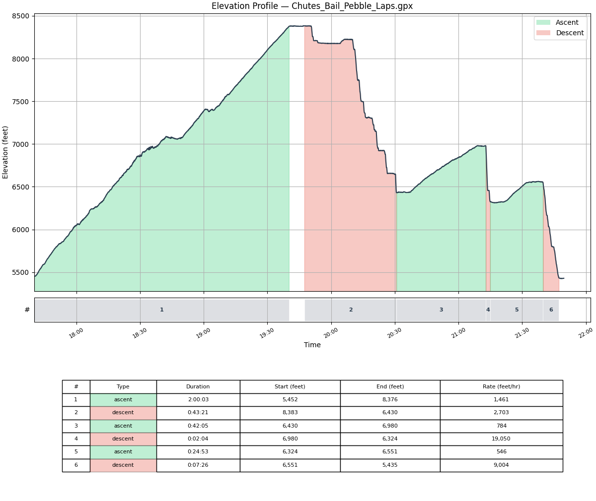

# gpx-segment-report

A command-line tool that parses GPX 1.1 track files and produces a tabular report of climbing and descending segments, along with optional elevation profile charts.



## What it does

Given a GPX track with elevation data, `gpx-segment-report`:

1. Identifies coarse-grained ascending and descending segments using a Ramer-Douglas-Peucker simplification pipeline
2. Trims flat/stagnant stretches (rest stops, transitions) from segment boundaries and interiors so they appear as gaps
3. Outputs a tab-separated report with timestamps, elevations, durations, and gain/loss rates
4. Optionally generates an elevation profile chart (PNG or SVG) with colored ascent/descent fills

## Installation

Requires Python 3.13+ and [uv](https://docs.astral.sh/uv/).

```bash
uv sync
```

## Usage

```bash
# Basic report (feet, default settings)
uv run gpx-segment-report track.gpx

# Report in meters
uv run gpx-segment-report track.gpx --unit meters

# Custom minimum segment height (in PRL units)
uv run gpx-segment-report track.gpx --min-height 150

# Generate an elevation profile chart
uv run gpx-segment-report track.gpx --output chart.png
```

### Options

| Flag | Description | Default |
|------|-------------|---------|
| `--unit`, `-u` | Elevation unit: `feet` or `meters` | `feet` |
| `--min-height`, `-m` | Minimum elevation change to qualify as a segment (in chosen unit) | 100 ft / 30 m |
| `--sport`, `-s` | Sport profile name | `ski_touring` |
| `--output`, `-o` | Save elevation profile chart to file (.png or .svg) | — |

### Example output

```
start_time                        end_time                          type     total_time  start_elevation  end_elevation  rate
2026-04-17T17:40:06+00:00         2026-04-17T19:40:09+00:00         ascent   02:00:03    5452.1           8376.0         1461.3
2026-04-17T19:50:44+00:00         2026-04-17T20:30:47+00:00         descent  00:40:03    8370.7           6430.4         2906.8
```

## Running tests

```bash
uv run pytest
```

The test suite includes both property-based tests (Hypothesis) and unit tests covering segment detection, gap trimming, formatting, and chart generation.

## License

[MIT](LICENSE)
